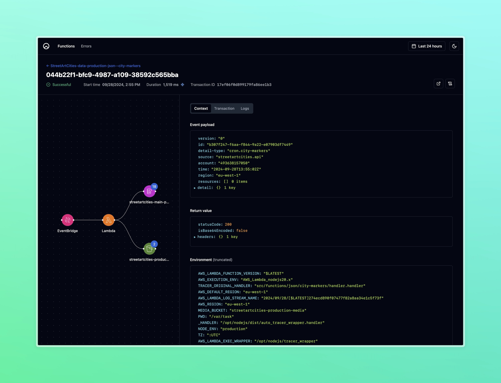

# TraceStack

**Self-hosted serverless tracing.**

Deploy a CloudFormation stack to your own AWS account for instant Lambda tracing.
Complete with a self-hosted UI, so you stay in full control of your data, and you
only pay for AWS usage related to tracing and storage.



## Batteries included

- **Auto-tracing**: deploy the stack, and a Lambda Layer for tracing will
  automatically be added to all your Node.js Lambda functions.
- **Self-managed trace DB**: traces are saved in a DynamoDB table within your
  AWS account, so they never leave your organization.
- **Private dashboard**: your self-hosted dashboard makes it easy to browse
  through invocations, filter for errors, and drill down into logs, AWS
  service operations and API calls your Lambda function executes.

## Getting started

Simply run the command below to deploy the stack:

```bash
npx deploy-trace-stack@latest
```

This command will clone the repo, prompt you with some questions to set configuration options,
and then use your current AWS credentials to deploy the stack.

Once you're done, it will display the URL for your new dashboard.

### Auto-tracing

Once installed, all Lambda functions in your AWS account will automatically be traced,
by adding a Lambda layer to them. You'll also notice a new environment variable called `AUTO_TRACE_HOST`.

If you wish to disable tracing for a specific function, you can add the environment variable `AUTO_TRACE_EXCLUDE`
with a value of `1`. This will keep the Lambda layer from being added.

Note that it might take up to 20 minutes for the application to detect any newly added Lambda functions and
start adding the tracing layer to them.

### How much will this cost?

We're only using the following AWS services:

- AWS DynamoDB
- AWS API Gateway
- AWS Lambda

This combo lets us pay only for our usage. For every invocation of your Lambdas, multiple calls 
will be made to the service, but these are quick and finish fast.

Ultimately, costs will depend on the overall number of Lambda executions in your AWS account.
